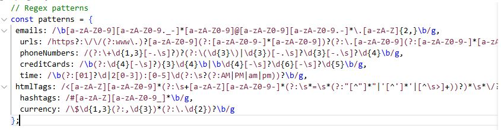
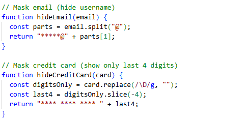

# Regex Data Extraction & Secure Validation (JavaScript)

## Overview

This project is a **regex-based data extraction and validation tool** built using **JavaScript**.  
It processes large, unstructured text files and extracts meaningful structured data such as emails, URLs, phone numbers, and other common real-world patterns.

The program is designed to work with **messy input**, where data is inconsistent and may include malformed or unsafe values. Only valid, well-formed data is extracted, while incorrect or suspicious input is ignored.

This project was implemented as part of the **Data Extraction & Secure Validation Assignment**.

---

## Assignment Context

The assignment simulates a real-world scenario where as a  **Junior Frontend Developer** I was required to process raw text data returned from an external API.

The task focuses on:

- Extracting structured data from raw text
- Validating input using strict regex patterns
- Handling realistic variations and edge cases
- Demonstrating awareness of malformed input
- Protecting sensitive information during output

According to assignment instructions, no UI or form design is required. The focus is entirely on **regex extraction and validation logic**.

---

## Data Types Extracted

This implementation supports the following data types:

- Email addresses  
- URLs  
- Phone numbers  
- Credit card numbers  
- Time values (12-hour and 24-hour formats)  
- HTML tags  
- Hashtags  
- Currency amounts  

Only **valid patterns** are extracted. Values that appear close to valid but do not meet formatting rules are intentionally rejected.

---

## Input

- Input is provided through a **predefined text file** (`sample.txt`)
- The text resembles real-world data such as logs, messages, emails, and broken HTML
- Valid and invalid data are mixed
- Data appears in unpredictable positions and formats

This ensures the solution reflects realistic production data rather than idealized examples.

---

## How the Program Works

1. Reads raw text from the input file
2. Applies manually written and strict regex patterns
3. Extracts only valid matches
4. Masks sensitive data before output
5. Writes results to a structured JSON file

Sensitive data such as **emails and credit card numbers** are partially hidden to prevent unnecessary exposure.

---

## Project Structure

alu_regex-data-extraction-honnete-1/
│
├── sample.txt              # Unstructured input text
├── extracted_data.json     # Output file (generated)
├── regex_program.js            # Main program
└── README.md               # Documentation

## Regex Pattern Definitions

## Masking Sensitive Data

## Outputs

- Extracted data is written to extracted_data.json

- Output is structured, readable, and easy to process

- Sensitive information is masked:

Email usernames are hidden

Only the last four digits of credit cards are shown

## Security & Validation Considerations
- Regex patterns are written to be strict and defensive

- Malformed or unsafe input is ignored

- The program assumes that raw input cannot be trusted

- Sensitive data is not fully exposed in outputs or logs

- The system demonstrates security awareness without implementing a full backend security system.

## How to run
**Requirements**
-Node.js installed
### Run Command
node regex_program.js
